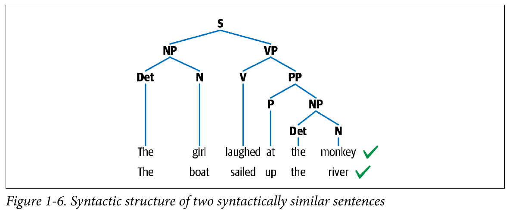
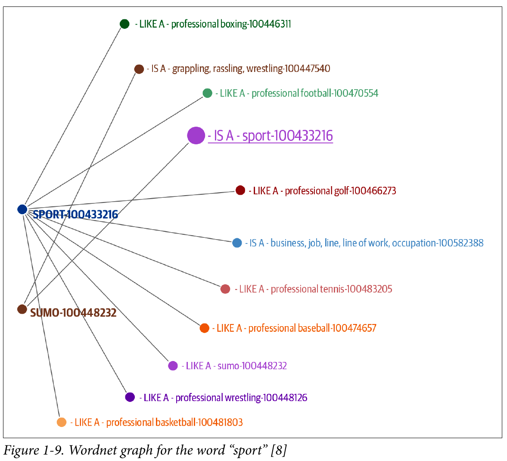

# NLP Tasks

- **Language modeling**: *Predicting what the next word in a sentence.*
- **Text classification**: *Bucketing the text into a known set of categories based on its content.*
- **Information Extraction**: *Extracting relevant information from text.*
- **Information Retrieval**: *Finding documents relevant to a user query from a large collection.*
- **Conversational agent**: *Building dialogue systems that can converse in human languages.*
- **Text summarization**: *Create short summaries of longer documents, preserving the overall meaning of the text.*
- **Question answering**: *System that can answer questions posed in natural language.*
- **Machine translation**: *One language to another*
- **Topic modeling**: *Topical structure from a large collection of documents.*

# Language structure

Phonemes, Morphenes & Lexemes, Syntax and Context.

## Phonemes

Smallest units of sound in a language. They may or may not have meaning by themselves. Are particularly important in applications involving speech understanding, such as speech recognition, speech-to-text transc., texto-to-speech conversion.

## Morphemes and Lexemes

Smallest unit that has a meaning. Formed by a combination of phonemes. Not all morphemes are words, but all prefix and suffixes are morphemes.

Lexemes are the structural variations of morphemes related to one another by meaning. Morphological analysis, is a foundational block for many NLP tasks, such as tokenization, stemming, learning word embeddings, and part-of-speech tagging, which we'll introduce in the next chapter.

## Syntax

Is a set of rules to construct grammatically correct sentences out of words and phrases in a language. A common approach to representing sentences is a parse tree.

This has a hierarchical structure of language, with words at the lowest level, followed by part-of-speech tags, followed by phrases, and ending with a sentence at the highest level.

Parsing is the NLP task of constructing such tree automatically. Entity extraction and relation extraction are some of the NLP tasks that build on this knowledge of parsing.

The syntax of a language can be veryyyy different from another.

## Context

Is how various parts in a language come together to convey a particular meaning. Context includes long-term references, world knowledge, and common sense along with the literal meaning of words and phrases.

Generally, context is composed from semantics and pragmatics. **Semantics** is the direct meaning of the words and sentences without external context. **Pragmatics** adds world knowledge and external context of the conversation to enable us to infer implied meaning.

## Why is NLP Challenging?

- Ambiguity
- Common knowledge
- Creativity
- Diversity across languages

## ML, DL and NLP: An overview

## Approaches to NLP

The different approaches used to solve NLP problems commonly fall into three categories: **heuristics**, **machine-learning**, **deep-learning**.

### Heuristics

- Building rules for the task at hand.
- Example, lexicon-based sentiment analysis is just a count of positive and negative words.
- Some tools improved the rule-based approach, Wordnet. Wordnet is a database of words and the semantic relationships between them.

- Regex area a great tool to build ruled-based-systems. Regexes area a great way to incorporate domain knowledge in your NLP system.
- Probabilistic regexes is a sub-branch that addresses this limitation by including a probability of a match (pregex).
- Rules and heuristics play a role across the entire life cycle of NLP projects even now. At one end, they're a great way to build first versions of NLP systems (like our base line).
- Rules and heuristics can also be **useful as features** for Machine-Learning-based NLP systems.
- ... also useful to plug gaps in production systems. Do not recommend treatment for a patient with a serious disease.

  

### **Machine Learning for NLP**

Supervised machine learning techniques such as classification and regression methods are heavily used for various NLP tasks.

Any ML approach for NLP, super or unsuper, can be described as consisting of three common steps: extracting features from text, using the features representation to learn a model, and evaluating and improving the model.

#### **Naive Bayes**

Relies on Bayes' Theorem, calculates the probability of observing a class label given the set of features for the input data. A characteristic of this algo is that it assumes each feature is independent of all others. 

Normally is used as a starting point algorithm for a text classification task. Simple to understand and very fast to train and run. **Base line**

#### **Support Vector Machine**

Used for Text Classification. An SVM can learn both a linear and non-linear decision boundary to separate data points belonging to different classes.

The biggest strength of SVMs are their robustness to variation and noise in the data.

A major weakness is the time taken to train and the inability to scale when there are large amounts of training data.

#### **Hidden Markov Model**

Is a statisical model that assumes there is an underlying, unobservable process with hidden states that generate the data. HMM tries to model the hidden states.

POS-tagging => We assume that there a grammar structure underneath the text.

- Assumptions:
  - Each hidden state is dependent on the previous
  - Human language is sequential in nature, and the current word in a sentence depends on what occurred before

#### **Conditional random fields**

Used for sequential data. Similar to the HMM but better.

  

### **Deep Learning for NLP**

#### **RNN**

Have neural units that are capable of remembering what they have processed so far. This memory is temporal, and the information is stored and updated with every time step as the RNN reads the next word.

RNN solves a grate diversity of NLP tasks: Text classification, named entity recognition, machine translation, etc...

#### **Long short-term memory**

LSTMs is similar to RNN but with a better memory. Work better in long texts.

#### **Convolution Neural Nets**

Used especially in text-classification tasks. Words as words vectors and those can be stacked one over another to form a matrix or 2D array. This matrix can now be treated similar to an image and can be modeled by a CNN.

CNN can look at the text in a context window.

#### **Transformers**

Transformers models have achieved state of the art in almost all major NLP tasks in the past two years. They model the textual data but not in a sequential manner.

- Given a word in the input, it prefers to look at all words around it (self attention) and represent each word with respect to its context.
  
Large transformers have been used for transfer learning, BERT is one of the famous models that use transformers.

Look at the self-attention mechanism

#### **Autoencoders**

Used mainly for learning compressed vector representation of the input. Texto -> vector representation.

Typically used to create feature representations needed for any downstream tasks.

### **Why DL is not yet the silver bullet for nlp?**

- overfitting on small datasets
- few-shot learning and synthetic data generation
- domain adaption
- interpretable models
- commom sense and world knowledge
- cost
- on-device deployment