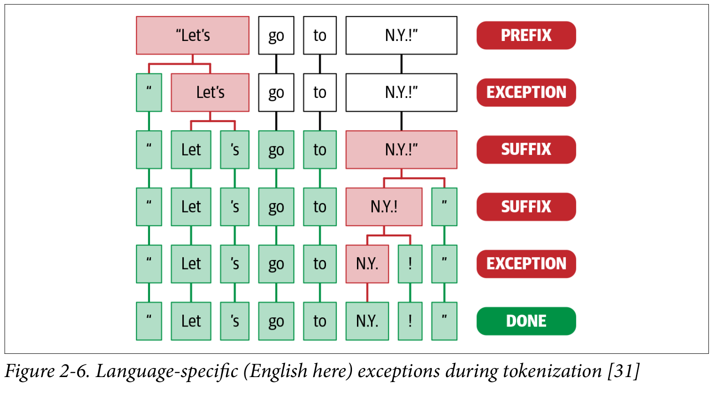
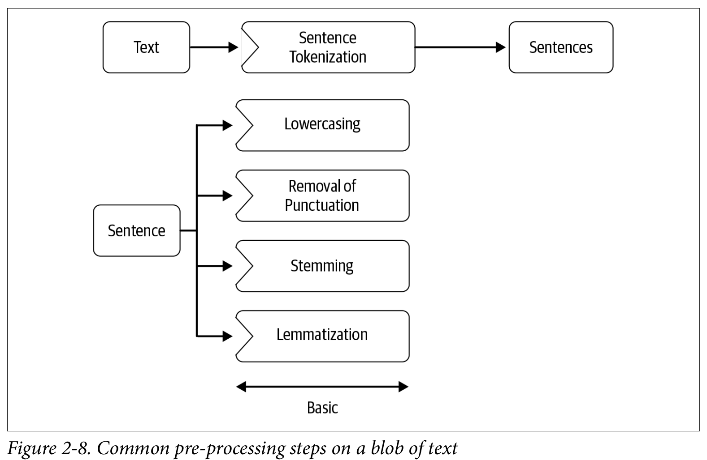

# NLP Pipeline

- Common procedures on NLP project.
  - Data acquisition
  - Text cleaning
  - Pre-processing
  - Feature Engineering
  - Modeling
  - Evaluation
  - Deployment
  - Monitoring and model updating

# Data Acquisition

Two pictures:

- You have all the data already labeled.
- more realistic, you'll need more data and also labeled the rest of the data.

Some NLP techniques:

- **Use a public dataset:** May or may don't have some public dataset similar to your task.
- **Scrape the data:** You may find some places to your problem, to scrape. But this is not the best solution, because inner products have specific names, specifics nuances that you'll need to look at the organization to capture. This step is like a start point to you have on what worker.
- **Product intervention:** The AI team should work with the product team to collect more and richer data by developing better instrumentation in the product.
- **Data Augmentation:** By the authors, this technique works veryyyy well in practice.
  - *synonym replacement*: Randomly choose 'k' words in a sentence that are not stop words, replace these with their synonyms. **Use Synsets in Wordnet.**
  - *Back translation:* Portuguese -> German -> Portuguese. 
  - *TF-IDF-based word replacement:* Works very well to handle the problem of loose information during the back translation.
  - *Replacing entities:* Replace entities like person name, location, organization, etc., with other entities in same category.
  - *Adding noise to data:* Noise helps to build robust models. In some cases is even possible to simulate "fat finger" problems. We can replace characters with their neighboring characters.
  - *Advanced techniques:* libs like snorkel, easy data augmentation, nlpAug...

# Text Extraction and Cleanup

Is like the data-wrangling of the NLP.

## HTML Parsing and cleanup

- `html-parsing.py`

## Unicode Normalization

Removing symbols, emojis, graphic characters.

- `unicode-normalization.py`

## Spelling Correction

This problem may hurt the linguistic understanding of the data, normally we have:

- **Shorthand typing**: Hllo world! I am back!
- **Fat finger problem**: I pronise that I will not bresk the silence again!

The options for these problems are a Microsoft API, or we can create a huge dictionary for our own spell checker. Reference 21.

## System-Specific Error Correction

- Extract text from different kinds of pdf. In this problem some libraries are utilized:
  - PyPDF, PDFMiner...
- OCR (optical character recognition), can also driven to a diverse amount of errors.
  - Tesseract is used to extract text from images

Python have a spell checker called pyenchant that may help to clean these kind of text.

```python
import enchant

d = enchant.Dict("pt_BR")
text = "Ecola"
print(d.check(text))
print(d.suggest(text))

> False
> ['Cola', 'Acola', 'Ucola', 'Escola', 'Evola', 'Acole', 'Ecoa', 'Ecolia', 'Encola', 'Recola', 'Decola', 'Mecola', 'Ebola']
```

# Pre-Processing

Are some more specific treatments on text to improve the NLP modeling.

- **Preliminaries**: Sentence segmentation and word tokenization
- **Frequent steps**: Stop word removal, stemming and lemmatization, removing digits/pucntuation, lowercasng, etc.
- **Other steps**: Normalization, language detection, code mixing, transliteration, etc.
- **Advanced processing**: POS tagging, parsing, coreference resolution, etc.

## Preliminaries

NLP software typically analyzes text by breaking it up into words (tokens) and sentences. Important step of the pipeline.

### Sentence segmentation

- look at the notebook

### Word Tokenization

- Simple rule: split the text into words based on the presence of punctuation
- But we have a lot of cases where the NLTK tokenizer doesn't works very well:
  - tokenizer on tweets will separate `#` from the name.
  - nltk have a special tokenizer for tweets, and we may need to create our own tokenizer for a specific problem.

As tokenization may differ from one domain to the other, tokenization is also heavily dependent on language. Each language can have various linguistic rules and exceptions.

spaCy can address the language-specific exceptions. It's also possible in spaCy to develop custom rules to handle such exceptions for languages that have high inflections (prefixes or suffixes) and complex morphology.

Depend on what you want to extract and how sensitive the rest of the pipeline is about such decisions. For identifying specific patterns is a great idea to create well-formed regex.

In many practical scenarios, we may end up using a **custom tokenizer** or **sentence segmenter** that suits our text structure instead of or on top of an existing one available standard NLP library.




## Frequent Steps

- Removing stop words: a, an, the, of... Words that don't add to much to our problem. There are some popular lists (`NLTK`) of stop words, but those can vary depending on what we're working on.
- lowercasing: normally used, but can happens the uppercasing too.
- punctuation and numbers removal.


### Stemming and Lemmatization

**Stemming** refers to the process of removing suffixes and reducing a word to some base form such that all different variants of that word can be represented by the same form: cars -> car

Although such rules may not always end up in a linguistically correct base form, stemming is commonly used in text classification and by search engines.

Stemming is used to reduce the feature space to train machine learning models.

>code about stemming and the algorithm called Porter Stemmer on NLTK

**Lemmatization** is the process of mapping all the different forms of a word to its base word, or lemma. Requires more linguistic knowledge, and modeling and developing efficient lemmatizers remains an open problem in NLP research.

Lemmatization are computacionaly expensive and are used just if was really necessary, because involves some amount of linguistic and its context.

Some steps doesn't need to be executed in sequence, but others need:

- lowercase before stemming
- lemmatization before lowercase or tokens removing: lemmatization needs context and to find the part of speech (lemma)

Know which steps do we'll need depends on the problem, so, is vary important to know your data well (good data exploration on the problem).




## Other Pre-processing Steps

### Text normalization

Social media text is very different from the language we'd see in newspapers. So, it's useful to reach a canonical representation of text that captures all these variations into one representation.

- all text to lower or upper
- convert digits to text
- expand abbreviations
- ...

sPacy have some methods to treat that.

### Language detection

Normally this is the first step on the pipeline, we can use `Polyglot` for that.

### Code mixing and transliteration

More than one language on the phrase (code-mixing), or specific words from another language written along with English or some principal language (transliteration). Common in multilingual communities.


## Advanced Processing

- POS tagging: for example to identify proper nouns on some documents. 

NLP libraries already have POS taggers implemented.


# Studos

- Oportunidades/Desafios/Dores
- Uma base em comum de dados possibilitando entender o aluno e suas dores em diferentes níveis. O que nos leva a iniciativas mais proativas.
- Compreendimento dos produtos, entender features mais utilizadas, validar estatisticamente a eficácia de uma modificação de front no app, no site...
- Compreender ainda nos produtos o que está levando a uma não utilização, por parte dos alunos e por parte de professores e coordenadores.
  - Aqui temos dados
- Criar recomendação dos produtos para diferentes escolas de forma automática.
- Tecnologias bem mais avançadas, utilização de Deep Learning para melhoramento de etapas de leitura de gabaritos.
- Criação de modelos de previsão de performance
- Criação de modelos de previsão de falhas
- Recomendação de questões para estudo com base no desempenho
  
- Tudo isso pode criar valor e diferencial de mercado absurdos, no entanto leva tempo.
- Sem esquecer que o objetivo final disso tudo que pontuei são as pessoas da ponta: estudantes e professores/coordernadores... Usuários desses produtos.

- Onde estamos, falando de Studos:
  - muito longe de possibilitar isso acontecer
- Onde estamos, falando da PSD:
  - bem encaminhados em direção a criação de uma infra de bigdata
- Onde estamos, falando de SAS:
- Onde estamos, falando de SAE:
- Onde estamos, falando de EDUQO:
- Onde estamos, falando de EEM:

- O local que eu entendo ser o ponto focal de utilização de todas as outras unidades possui a menor maturidade analítica e também não possui nenhum engenheiro de dados para dar um start nesse processo.

- Não precisamos por enquanto de um canhão, mas pelo menos de algum armamento. As análises que fizemos até o momento trouxeram valor, mas poderiam ter acontecido de forma mais rápida e mais segura.

- O processo analítico ele não obedece muito as metodologias ágeis, por que muitas vezes nós temos apenas hipóteses para tentar comprovar sua validade, não existem entregáveis bem definidos, nem todo problema seu é um modelo, muitas vezes vc não sabe nem se vc vai precisar de um modelo.

- O ponto principal nesse momento é, confiança nos dados que estamos analisando, desvinculação das consultas para análise da base de produção para um local específico. 

- Criação de um lake para armazenamento de tabelas resultados de análises, formato comprimido, pouco espaço.

- 
