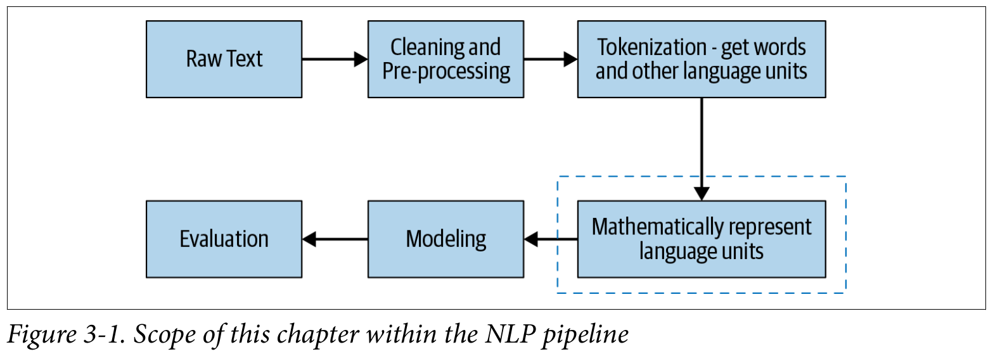
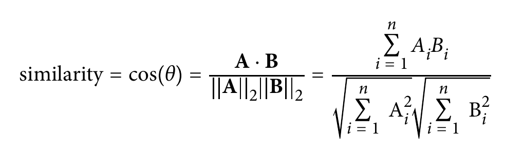

# Text Representation

- In any modeling step, poor features will give you poor results. *Garbage in, garbage out*.
- Our task here is represent a text as a numerical form and pass this into a NLP and ML algos.

Look at where we are in the pipeline:

Text is very different than all others problems, here we don't have a clear transformation into numbers.

- Images goes into pixels matrices
- Videos goes into frames and frames into pixels matrices
- Sound (speech) goes as waves signals

The book separate this into 4 categories:
- basic vectorization approaches
- distributed representations
- universal language representation
- handcrafted features

---------

## Vector Space Models

- Text Units: characters, phonemes, words, phrases, sentences, paragraphs, documents.
- Vector Space Model is fundamental to many **information-retrieval operations, from scoring documents on a query to document classification and document clustering**.
- Most common way to find similarity between two text blobs is using cosine similarity.

The most important point is find the vector that better captures the linguistic properies of the text it represents.

---------

## Basic Vectorization Approaches

Map each word in the vocabulary of the text corpus to a unique ID, then represent each sentence of document in the corpus as a V-dimensional vector.

>example main.ipynb

### One-Hot Encoding

Each word in the corpus vocabulary is given a unique integer.

For example, *dog* in a corpus that have *[dog, bites, man, meat, food, eats]* and for text that have [dog, meat, eats], the representation will be [[1 0 0 0 0 0], [0 0 0 1 0 0], [0 0 0 0 0 1]].

A few shortcomings from one-hot encoding:

- The size of a one-hot vector is directly proportional to size of the vocabulary, and most real-world corpora have large vocabularies. **This results in a sparse representation where most of the entries in the vectors are zeroes, making it computationally inefficient to store, compute with, and learn from.** SPARSITY LEADS TO OVERFITTING.
- This representation does not give a fixed-length representation for text.
- It treats word as atomic units and has no notion of (dis)similarity between words. Very poor semantically.
- Out of vocabulary, words where the model was not trained.

>THIS DAYS, ONE-HOT ENCODING SCHEME IS SELDOM USED

### Bag of Words (BoW)

Commonly used in text classification.

Represent the text under classification as a bag of words while ignoring the **order and context**. 

The basic intuition behind it is that it assumes that the text belonging to a given class in the dataset *is characterized by a unique set of words*.

This approach is very similar to one-hot, but here we count how many times a word appear in the text, and end up having a lower dimensional representation than one-hot.

Normally BoW will count the how many each word appear on the text, but sometimes (sentiment analysis) we want just register if that word appear or not. This can be achieved with sckit-learn `CountVectorizer(binary=True)`.

### Bag of N-Grams

- BoN break the text into chunks of n contiguous words.
- This can help us to get some context
- Increasing the number of n we capture more context, but we also increase the sparsity, and sparsity is not computationally efficient and leads to overfitting.
- **Thus, resulting vector space is able to capture some semantic similarity. Documents having the same n-grams will have their vectors closer to each other in Euclidean space as compared to documents with completely different n-grams.**
- It still provides no way to address the OOV problem.

### TF-IDF

Term frequency-inverse document frequency tries to quantify the importance of a given word relative to other words in the document and in the corpus
Commonly used for *information-retrieval systems*, for extracting relevant documents from a corpus for a given text query.

$$

TF(t, d) = \frac{NumberOfOcurrencesOfTerm tin document d}{Total number of terms in the documentd}
$$

$$
IDF(t) = log_{e}=\frac{TotalNumberOfDocumentsinTheCorpus}{NumberDocumentsWithTermtInThem}
$$

TF is a count of each word on the document normalized by the length of that document. And IDF is a measure that will weighs down the terms that are very common across a corpus and weighs up the rare terms.

TF * IDF will give you the *TF-IDF score*.

Is common to say that we need to train a tf-idf on the training corpus and use that to predict on test dataset?

There are several variations of the basic TF-IDF formula. The sckit it self have a different way to calculate those params to address 0 divisions and other penalizations.

>Even today, TF-IDF continues to be a popular representation scheme for many NLP tasks, especially the initial versions of the solution.

All the forms to vectorization showed until now have some drawbacks:

1. **They're discrete representations: language units as atomic units, do not capture relationship between words.**
2. **Feature vectors are sparse and high-dimensional representations. Bigger vocab -> Higher dimensionality**
3. **They cannot handle OOV words** 

---------

## Distributed Representations

Key terms:

- **Distributional similarity**: Meaning of the word can be understood from the context in which the word appears. Also known as connotation. Connotation -> context meaning, Denotation -> literal meaning.
- **Distributional Hypothesis**: In linguistics, this hypothesizes that **words that occur in similar contexts have similar meanings (cat and dog)**. Here the words also are represented as vector and two vectors that have close meaning must also be close to each other.
- **Distributional Representation**: representation schemes that are obtained based on distribution of words from the context in which the words appear. This schemes are based on distributional hypotheses. Are high-dimensional representations that captures co-occurrence of a word, so all four schemes that we've seen so far - one-hot, BoW, BoN-gram e TF-IDF - all fall under the umbrella of distributional representation.
- **Distributed representation**: similar concept, but result in a compact and dense vector.
- **Embedding**: Is a mapping between a vector space coming from distributional representation to vector space coming from distributed representation.
- **Vector semantics**: Set  of NLP methods that aim to learn the word representations based on distributional properties of words in a large corpus.

### Word Embeddings

>A text representation should capture "distributional similarities between words"!

This means that *USA* will have distributionally similar words on countries (Canada, Germany, Brasil...).

- **Important**: Mikolov -> NN-based word representation model *Word2vec* (2013).
  - Capture analogies like: King - Man + Woman == Queen

>Word2vec model is in many ways the dawn of modern-day NLP

Word2vec ensures that the learned word representations are low dimensional (vectors with 50-500... instead of several thousands),

To "derive" the meaning of the word, Word2vec uses **distributional similarity** and **distributional hypothesis**. 

>If two different words (often) occur in similar context, then it's highly likely that their meanings are also similar. 

Word2vec operationalizes this by projecting the meaning of the words in a vector space where words with similar meanings will tend to cluster together, and words with very different meanings are far from one another.

For every word w in corpus, we start with a vector v_w init with random values. The Word2vec model refines the values in v_w by predicting v_w.

#### Pre-trained word embeddings

These embeddings can be downloaded and used to get the vectors for the words you want. We can think this embeddings as a large collection of key-value pairs, where keys are the words in the vocabulary and values are their corresponding word vectors.

Most popular pre-trained embeddings:
- Word2vec by Google
- GloVe by Stanford
- fasttext by Facebook

>main.ipynb

#### Training our own embeddings

Two variants:
- CBOW: Continuous bag of words
- SkipGram

##### CBOW

